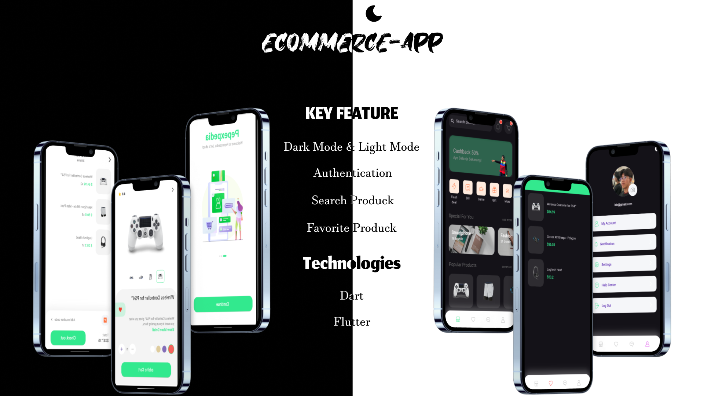

# Pepexpedia

Pepexpedia adalah aplikasi jual beli barang yang dirancang untuk memberikan pengalaman belanja yang mudah dan menyenangkan.
aplikasi ini memungkinkan pengguna untuk menjelajahi berbagai produk, melakukan pembelian, dan menjual barang mereka sendiri.

## Fitur

- **Marketplace**: Temukan berbagai produk yang menarik untuk dibeli dari penjual yang berbeda.
- **Detail Produk**: Dapatkan informasi lengkap tentang setiap produk, termasuk deskripsi, foto, dan ulasan.
- **Favorit**: Tandai produk yang disukai untuk akses cepat di masa depan.
- **Penjual**: Pengguna dapat mendaftar sebagai penjual dan mengunggah produk mereka sendiri.
- **Antarmuka Menarik**: Desain yang responsif dan ramah pengguna untuk pengalaman yang lebih baik.

## Teknologi

Aplikasi ini dibangun menggunakan:

- [Flutter](https://flutter.dev/) - Framework untuk pengembangan aplikasi lintas platform.
- [Dart](https://dart.dev/) - Bahasa pemrograman yang digunakan untuk pengembangan aplikasi.

